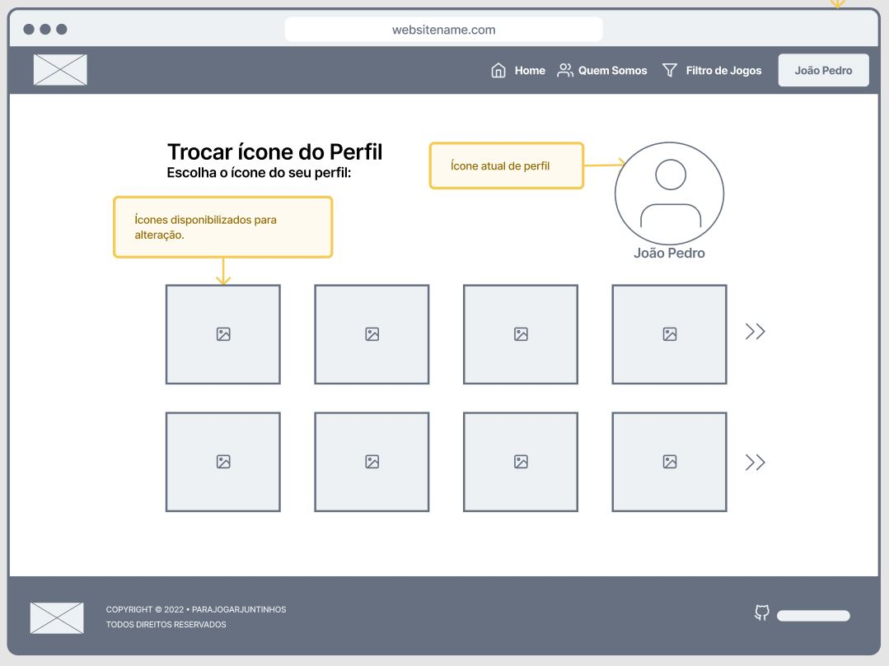
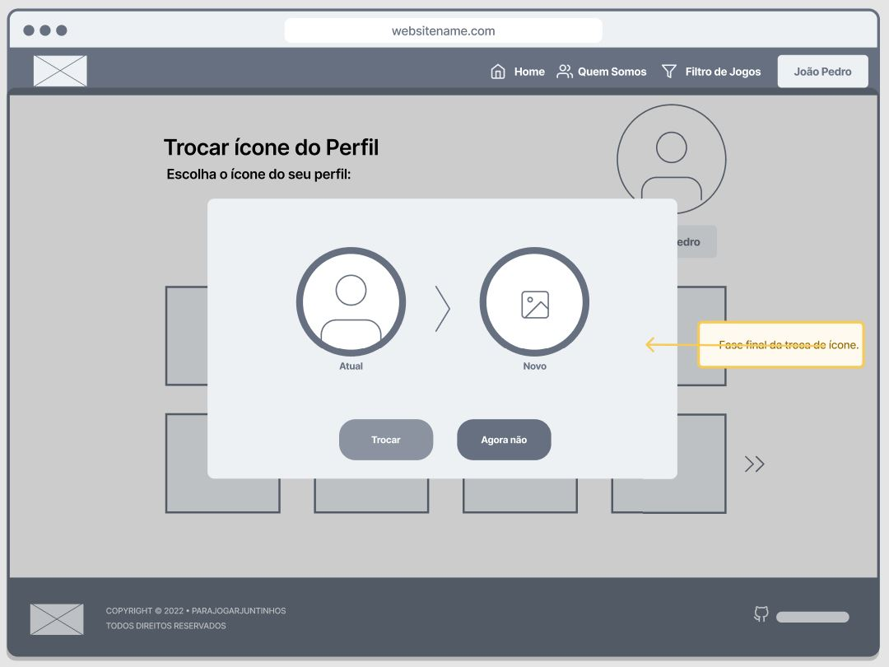

# Projeto de Interface

O projeto de interface está organizado em 8 páginas: Homepage, Quem Somos, Filtro de Jogos, Informações de Jogo, Login, Cadastro, Perfil e Edição de Perfil. O conteúdo foi organizado de modo a incentivar, facilitar a busca por jogos cooperativos. Em todas as páginas acessadas pelo usuário, há botões que redirecionam o usuário para a homepage, quem somos e filtro de jogos, ou mesmo em algumas páginas, a possibilidade de ser redirecionado para uma página externa.

## User Flow

## Wireframes

### Homepage

A experiência do usuário se inicia na homepage. Nela, ele poderá visualizar o layout da página e também acessar todas as seções do site (quem somos, filtro de jogos, login/perfil) através dos botões do menu de navegação, e também acessar a página de informação de um jogo ao selecionar um dos cards ao longo da página. Além disso, há também o rodapé, com logo do projeto e link para o repositório no github.

A barra de navegação do site para um usuário que esta logado exibe seu nome/nikename no lugar do botão de login. Esse botão dispara um dropdown com outros dois botões, um que acessa a página de perfil e outro que faz o logout.

Através da homepage, no menu de navegação é possível acessar a opção "Quem Somos" que leverá o usuário até a página de identificação do projeto. Na página é possível conhecer aspectos importantes como missão, história e integrantes do projeto.

### Login

A partir da Homepage, utilizando o menu de navegação, o usuário irá clicar no botão "Login" para acessar a página. Com a página carregada ele irá encontrar dois campos de Nome e Senha. Campos pra preencher com os dados do usuário que já possui cadastro no site  

### Cadastro

Caso o usuário não tenha cadastro, ele irá encontrar mais a baixo do site o botão "Inscrever-se no Pra Jogar Juntinho". Clicando nesse botão o usuário será redirecionado para uma nova tela, que é a de Cadastro. Nessa tela ele irá colocar Seu nome ou nick para a identificação no site, e uma senha para fazer login futuramente. Com os campos preenchidos basta clicar no botão de “Inscreva-se” para confirmar seu cadastro.

 
### Feedback Positivo

Caso o cadastro seja concluído com sucesso será mostrada uma mensagem positiva e um comentário sobre os benefícios de se estar logado. Após, o usuário será levado a tela de login.

 ### Feedback Negativo

Caso o cadastro não tenha sido possível, será mostrada uma mensagem negativa pedindo a ele para tentar novamente. Nesse caso ele poderá fazer outra tentativa de cadastro ou poderá fazer login caso tenha se lembrado de alguma conta que já tenha no site.

 

 
 ### Tela do Jogo não logado
 
Quando o acesso é feito na página do jogo e não está logado, informamos um trailer do jogo como tela principal, três ícones acima dessa tela que são referentes a lista de desejos, ranking que o jogo ocupa no site, e função de compartilhamento. É mostrado abaixo do trailer uma lista de jogos relacionados, e na parte esquerda ao trailer mostramos uma foto miniatura do jogo e informações de preço e feedback positivo ou negativo com base nas análises dos usuários.
 

 

 

### Perfil
A partir da Homepage, utilizando o menu de navegação o usuário irá clicar no botão de "perfil" para acessar a página de Perfil. Nela o usuario pode encontrar em formato de lista os jogos que ele favoritou bem como os jogos que ele comentou utilizando o site, outra opção que ele encontrará é um botão que o leva à tela de edição do perfil.

 

### Edição de Perfil
Partindo da tela de perfil e clicando no botão de edição do perfil, o usuário tem acesso à página de edição do perfil, nela ele pode alterar informações de login (Nome/Nickname e senha) e o botão que o leva à tela de edição do ícone de perfil.

 

### Edição de ícone do perfil
Ao clicar no botão na tela de Edição de Perfil, o usuário terá acesso à tela de Edição do Ícone do Perfil, nela ele terá acesso à imagens predefinidas que poderão ser utilizadas como ícone de perfil, para escolher a imagem basta que o usuário clique na imagem desejada.

 

### Confimação da alteração
Ao clicar na imagem que ele deseja como ícone de perfil, o usuário poderá comparar o ícone utilizado anteriormente com a nova escolha, para confirmar a alteração basta que o usuário clique em "Trocar" ou se deseja cancelar a alteração ele deve clicar em "Agora Não" que será redirecionado à tela de edição de ícone do perfil. 

 

